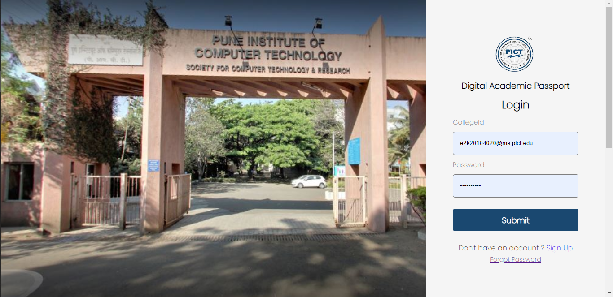

<!-- PROJECT LOGO -->
 

                                                                
  <h1>Digital Academic Passport</h1>
  
   
  <h2>Login Page</h2>
  
<b>Login Page for Student</b>

  
  
   
  <h2>Student Dashboard</h2>
  
  
<b>There are various components to Update the Profile of students.</b>

    
  <h2>Academic Details</h2>
  
  
<b>Here student can update there academic details</b>

    
 
  <h2>Update Personal Details</h2>
  
<b>To update personal Details</b>

  
   
    
  <h2> Application Forms</h2>
  <!-- 
<b>To update personal Details</b>
 -->
  
   
    
    <h2>To view uploaded pdfs</h2>
  
   
    
    <h2>Teachers Dashboard</h2>
  
   
    
     <h2>Intern's Data</h2>
       
<b>Teachers can verify the Student's Internship Data</b>

  
   
    
     <h2>Batches</h2>
       
<b>Teachers can create student's batches and can also add there parents to the mail group as well.</b>

  
   
    
  

